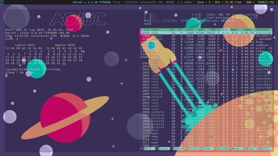

# **i3-Flat**

A beautiful and minimal ambiance

[] (https://raw.githubusercontent.com/Manu-sh/i3-Flat/master/img/screenshot/scr1.png)


##Build or install following dependencies:

* [i3-gaps](https://github.com/Airblader/i3) 
* [i3status](https://github.com/i3/i3status) 
* [conky](https://github.com/brndnmtthws/conky) 
* [rxvt-unicode](http://dist.schmorp.de)
* [urxvt-pearls](http://www.github.com/muennich/urxvt-perls) 
* [compton](https://github.com/chjj/compton) 
* [feh](http://feh.finalrewind.org)

alternatively you can install [xfce4-terminal] (#xfce4-terminal)

##Arch Linux

```
yaourt -S i3-gaps
pacman -S feh urxvt-perls rxvt-unicode conky compton i3status
```

##Optional dependencies

* [vim](https://github.com/vim/vim)
* [nano](https://www.nano-editor.org/download.php)
* [amix/vimrc](https://github.com/amix/vimrc) vimrc and some plugin   
* [figlet](http://www.figlet.org/) ascii text on terminal


## Configure i3

Add following line on your i3 config file

```
#palette

 set $black #1C1C1C
 set $cyan #87D7FF
 set $blue #268bd2
 set $green #60B48A 
 set $magenta #d33682 
 set $yellow #D7D787
 set $grey #93a1a1
 set $pink #eee8d5 
 set $red #dc322f

ibar {
    #launch json wrapper
    status_command $HOME/.config/i3/conky-wrapper-i3
	position top

   colors {
     separator $blue
     background $black
     statusline $grey
     focused_workspace $cyan $black $cyan
     active_workspace $pink $black $pink
     inactive_workspace $yellow $black $yellow
     urgent_workspace $magenta $magenta $pink
   }
}

 client.focused $black $black $green $black
 client.focused_inactive $black $black $pink $black
 client.unfocused $black $black $grey $black
 client.urgent $magenta $magenta $pink $red

#internal gaps border
gaps inner 10

#external gaps border
gaps outer 15

#border propriety for new windows
new_window pixel 3 

#default fonts
font pango:Monospace 10.5

#disable border for urxvt windows 
for_window [instance=urxvt] border none

#script for launch urxvt in i3 with support utf-8
bindsym $mod+Return exec urxvtf
```

more info on json wrapper: https://i3wm.org/docs/user-contributed/conky-i3bar.html


#bashrc
```
#get color manpages (using pager less)
man() {
    env \
    LESS_TERMCAP_mb=$'\033[01;31m' \
    LESS_TERMCAP_md=$'\033[01;31m' \
    LESS_TERMCAP_me=$'\033[0m' \
    LESS_TERMCAP_se=$'\033[0m' \
    LESS_TERMCAP_so=$'\033[01;44;33m' \
    LESS_TERMCAP_ue=$'\033[0m' \
    LESS_TERMCAP_us=$'\033[01;32m' \
    man "$@"
}
export GROFF_NO_SGR=1


#a different clear
regen() {
clear
figlet -c "AC/DC"
echo -ne "Data: $(date)\n
\b Kernel: $(uname -smr)
\b CPU: $(grep -w "model name" /proc/cpuinfo|uniq|cut -f2 -d ":"|sed s'/[ \t]*//')
\b Core: $(nproc --all)
\b $(cal -n 2)\n"
PS1="\u@\h[\t]\w ⚡}➤"
}

#first of end of file rember to call function regen for print prompt
regen

```

#xinitrc
```
#compositor
compton -b

#merge urxvt config (not needed if you use xfce4-terminal)
xrdb -merge $HOME/.config/i3/Xresources-urxvt

#set your wallpaper
feh --bg-fill $HOME/.config/i3/wallpaper/flat01.jpg

#setting keyboard (generally not needed) 
#setxkbmap it

#launch wm
i3
```
#Finalize ambiance configuration
```
cp -v conkyrc-i3 conky-wrapper-i3 Xresources-urxvt ~/.config/i3
cp -v nanorc ~/.nanorc
```

#xfce4-terminal

create config directory if doesn't exist

``
mkdir -pv  ~/.config/xfce4/terminal
``

copy config for xfce-terminal

``
cp -v  terminalrc ~/.config/xfce4/terminal/terminalrc
``

##Additional Info:
[urxvt] (http://pod.tst.eu/http://cvs.schmorp.de/rxvt-unicode/doc/rxvt.1.pod)
[xinitrc] (https://wiki.archlinux.org/index.php/Xinit)
[display manager] (https://wiki.archlinux.org/index.php/Display_manager)
